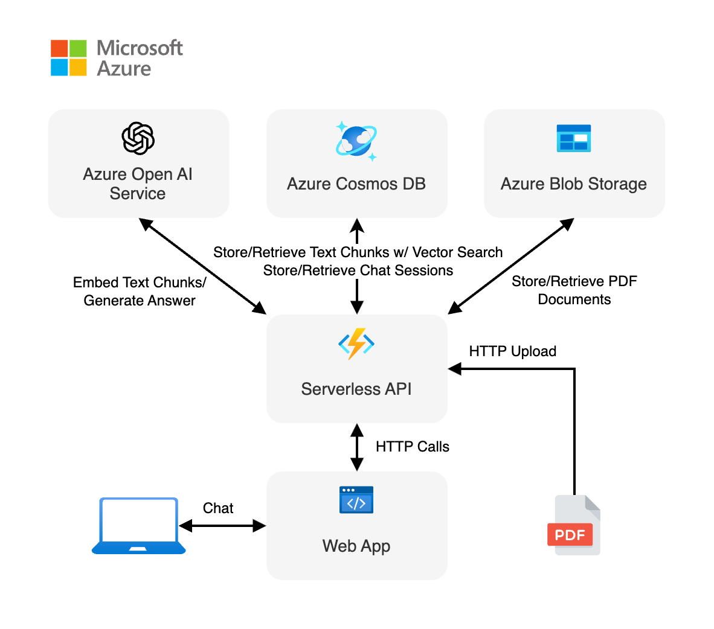

<!-- prettier-ignore -->
<div align="center">


# DeepSME Copilot

**AI-Powered Assistant for African Small and Micro-Enterprises**

[](LICENSE)
[](https://nodejs.org/)
[](https://www.typescriptlang.org)

:star: If you like this project, star it on GitHub — it helps a lot!

[Problem Statement](#the-problem-i-am-solving) • [Why This Template](#why-i-picked-this-template) • [Customizations](#what-customizations-i-made) • [Getting Started](#getting-started) • [Architecture](#architecture) • [Troubleshooting](#troubleshooting)


</div>

## The Problem I Am Solving

Small and Micro-Enterprises (SMEs) in Africa face significant challenges in accessing reliable business guidance, financial literacy support, and compliance information. Specifically:

### **Financial Literacy Challenges**

- Limited access to bookkeeping and tax guidance
- Difficulty understanding KRA tax returns and NHIF/NSSF contributions
- Lack of knowledge about loan records and invoice management

### **Compliance and Regulatory Barriers**

- Complex Kenyan business registration processes
- Confusing permit requirements and renewal procedures
- Limited understanding of cooperative registration with Ministry of Co-operatives

### **Business Growth Obstacles**

- Insufficient knowledge about financing options (KEJET, NYOTA, Financial Inclusion Fund)
- Poor customer service and grievance handling practices
- Limited understanding of digital payment systems (M-Pesa, banking)
- Lack of awareness about savings groups (chamas) and SACCOs

### **Information Access Issues**

- Scattered information across multiple government agencies
- Language barriers in official documentation
- Limited internet connectivity for research
- Cost of professional business consultancy

**DeepSME Copilot addresses these challenges by providing an AI-powered assistant that offers instant, practical guidance in simple language, backed by official Kenyan SME resources.**

> [!TIP]
> You can test this application locally without any cost using [Ollama](https://ollama.com/). Follow the instructions in the [Local Development](#local-development) section to get started.

## Overview

Building AI applications can be complex and time-consuming, but using LangChain.js and Azure serverless technologies allows me to greatly simplify the process. This application is a chatbot that uses a set of SME-focused documents to generate responses to business queries.

I provide sample data focused on African SME challenges to make this ready to try, but feel free to replace it with your own. I focus on **Kenyan Small and Micro-Enterprises**, and the experience allows business owners to ask questions about compliance, financing, tax guidance, and business development. The sample data includes documents from MSEA, KEJET, NYOTA, and other relevant Kenyan business resources.

<div align="center">
  
</div>

This application is made from multiple components:

- A web app made with a single chat web component built with [Lit](https://lit.dev) and hosted on [Azure Static Web Apps](https://learn.microsoft.com/azure/static-web-apps/overview). The code is located in the `packages/webapp` folder.

- A serverless API built with [Azure Functions](https://learn.microsoft.com/azure/azure-functions/functions-overview?pivots=programming-language-javascript) and using [LangChain.js](https://js.langchain.com/) to ingest SME-focused documents and generate responses to business queries. The code is located in the `packages/api` folder.

- A database to store chat sessions and the text extracted from business documents and the vectors generated by LangChain.js, using [Azure Cosmos DB for NoSQL](https://learn.microsoft.com/azure/cosmos-db/nosql/).

- A file storage to store the source SME documents, using [Azure Blob Storage](https://learn.microsoft.com/azure/storage/blobs/storage-blobs-introduction).

I use the [HTTP protocol for AI chat apps](https://aka.ms/chatprotocol) to communicate between the web app and the API.

## Why I Picked This Template

I chose the **Azure Serverless AI Chat with RAG using LangChain.js** template because it provides:

### **Technical Advantages**

- **Serverless Architecture**: Cost-effective scaling for SMEs with varying usage patterns
- **RAG (Retrieval-Augmented Generation)**: Ensures responses are based on verified official documents
- **Multi-modal Support**: Can integrate with WhatsApp, USSD, and web for diverse user access
- **Offline Capability**: Can run locally with Ollama for areas with limited internet

### **Business Benefits**

- **Quick Deployment**: Faster time-to-market for SME assistance
- **Document Integration**: Easy ingestion of official Kenyan government documents
- **Chat History**: Maintains conversation context for ongoing business guidance
- **Customizable**: Flexible framework for African market adaptation

### **SME-Specific Features**

- **Multiple AI Models**: OpenAI for cloud, Ollama for local deployment
- **Document Management**: Perfect for integrating MSEA, KEJET, NYOTA resources
- **Scalable Storage**: Azure Cosmos DB for growing user base
- **Cost Control**: Pay-per-use model suitable for development budgets

## What Customizations I Made

### **1. Complete Branding Transformation**

- **Logo Design**: Created interactive neural network logo with hexagonal SME structure
- **Color Scheme**: Changed from green to professional navy blue with AI aesthetics
- **Typography**: Updated to reflect business professionalism
- **Favicon**: Custom SVG with SME business patterns

### **2. SME-Focused Content**

- **System Prompt**: Rewrote AI assistant persona to focus on African SME support
- **Prompt Suggestions**: Replaced generic examples with specific Kenyan business questions:
  - "How do I access the Financial Inclusion Fund for my SME?"
  - "What training programs does KEJET/NYOTA offer for small businesses and How do I apply for them?"
  - "How can I register my cooperative with the Ministry of Co-operatives?"
  - "What business development services are available from MSEA?"

### **3. UI/UX Enhancements**

- **Welcome Message**: "Welcome to DeepSME Copilot! Ask me anything about your business..."
- **Mobile Responsiveness**: Enhanced navigation for mobile/USSD integration
- **Accessibility**: Improved for users with varying tech literacy levels
- **Interactive Elements**: Animated logo with neural network patterns

### **4. Backend Optimizations**

- **OpenAI Integration**: Configured for OpenAI API instead of Azure OpenAI for broader access
- **Document Structure**: Prepared for Kenyan government document ingestion
- **Error Handling**: Improved user-friendly error messages
- **Performance**: Optimized for African internet conditions

### **5. Content Preparation**

- **Sample Documents**: Created SME business guide with Kenyan context
- **Official Sources**: Prepared structure for MSEA, KEJET, NYOTA, Ministry documents
- **Language Support**: Framework for Swahili and local language integration

### **6. Deployment Configuration**

- **Environment Variables**: Configured for OpenAI API and Azure services
- **Local Development**: Set up Ollama for offline testing
- **Security**: Enhanced for business data protection

## Features

- **Serverless Architecture**: Utilizes Azure Functions and Azure Static Web Apps for fully serverless deployment optimized for African SME needs.
- **Retrieval-Augmented Generation (RAG)**: Combines Azure Cosmos DB and LangChain.js to provide responses based on verified Kenyan business documents.
- **SME-Focused Chat Interface**: Tailored for small business owners with simplified language and relevant prompts.
- **Chat Sessions History**: Maintains personal chat history for ongoing business guidance and relationship building.
- **Multi-Language Ready**: Framework prepared for Swahili and other local languages.
- **Mobile-First Design**: Optimized for mobile access common in African markets.
- **Offline Capability**: Supports local development using Ollama for areas with limited internet connectivity.
- **Cost-Effective**: Leverages Azure's serverless offerings with pay-per-use model suitable for development budgets.
- **Document Management**: Easy integration of official government and business development resources.
- **Scalable Storage**: Azure Cosmos DB designed to grow with expanding user base across Africa.

## Getting Started

There are multiple ways to get started with this project.

The quickest way is to use your local environment for development. You can also deploy directly to Azure for production use.

> [!IMPORTANT]
> If you want to run this application entirely locally using Ollama, follow the instructions in the [Local Development with Ollama](#local-development-with-ollama) section.

### Prerequisites

- [Node.js LTS](https://nodejs.org/download/)
- [Azure Developer CLI](https://aka.ms/azure-dev/install)
- [Git](https://git-scm.com/downloads)
- [PowerShell 7+](https://github.com/powershell/powershell) _(for Windows users only)_
- [Azure Functions Core Tools](https://learn.microsoft.com/azure/azure-functions/functions-run-local)

### Quick Start

1. **Clone the repository**

   ```bash
   git clone <your-repo-url>
   cd deepsme-copilot
   ```

2. **Install dependencies**

   ```bash
   npm install
   ```

3. **Set up environment variables**

   - For Azure: Configure OpenAI API key in Azure environment
   - For local: Set up Ollama (see Local Development section)

4. **Deploy to Azure**

   ```bash
   azd auth login
   azd up
   ```

5. **Upload SME documents**
   ```bash
   npm run upload:docs
   ```

## Architecture

<div align="center">
  
</div>

### **Components**

- **Web App**: Lit-based chat interface hosted on Azure Static Web Apps, optimized for SME user experience
- **API**: Azure Functions with LangChain.js for document processing and chat responses focused on business guidance
- **Database**: Azure Cosmos DB for NoSQL (chat history and vector storage of SME documents)
- **Storage**: Azure Blob Storage for SME business documents and government resources
- **AI Models**: OpenAI GPT-4o-mini for production, Ollama for local development

### **Data Flow**

1. **User Query**: SME owner asks business question via web interface
2. **Document Retrieval**: RAG system searches relevant Kenyan business documents
3. **AI Processing**: LangChain.js combines query with retrieved context
4. **Response Generation**: AI provides practical, step-by-step guidance
5. **History Storage**: Conversation saved for ongoing business support

### **Integration Points**

- **WhatsApp Business API**: For mobile users (future enhancement)
- **USSD Gateway**: For feature phone access (future enhancement)
- **Government APIs**: Direct integration with MSEA, KRA systems (future enhancement)

## Troubleshooting

If you encounter issues while running or deploying DeepSME Copilot, please check our [troubleshooting guide](./docs/troubleshooting.md). For additional support, please [open an issue](https://github.com/USER/deepsme-copilot/issues) in this repository.

### **Common Issues**

- **"We are currently experiencing an issue"**: Check OpenAI API key configuration
- **Document upload fails**: Verify Azure Function app is running and accessible
- **Local development issues**: Ensure Ollama models are downloaded and running

## Contributing

This project has adopted the [Microsoft Open Source Code of Conduct](https://opensource.microsoft.com/codeofconduct/).
For more information see the [Code of Conduct FAQ](https://opensource.microsoft.com/codeofconduct/faq/) or
contact [opencode@microsoft.com](mailto:opencode@microsoft.com) with any additional questions or comments.

## Trademarks

This project may contain trademarks or logos for projects, products, or services. Authorized use of Microsoft
trademarks or logos is subject to and must follow
[Microsoft's Trademark & Brand Guidelines](https://www.microsoft.com/en-us/legal/intellectualproperty/trademarks/usage/general).
Use of Microsoft trademarks or logos in modified versions of this project must not cause confusion or imply Microsoft sponsorship.
Any use of third-party trademarks or logos are subject to those third-party's policies.

---

<div align="center">

**Built with ❤️ for African SMEs**

_Empowering small businesses with AI-driven guidance_

**© 2025 itskipronoh. All rights reserved.**

</div>
